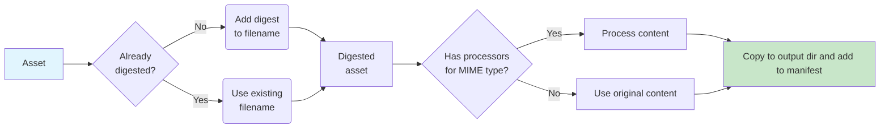

# hifi-assets

> hifi-assets is a Clojure asset pipeline inspired by Rails' Propshaft.
> Designed for simplicity and maintainability.


hifi-assets provides digest-based asset management for cache busting and efficient delivery with developer friendly ergonomics.

It is designed for modern development where transpilation, bundling and compression have become less essential for the types of web applications built with hifi.
Browsers have evolved with better native capabilities, network speeds have increased, and HTTP/2 is become widespread.


<!-- markdown-toc start - Don't edit this section. Run M-x markdown-toc-refresh-toc -->
**Table of Contents**

- [hifi-assets](#hifi-assets)
  - [How it works](#how-it-works)
  - [Configuration](#configuration)
  - [Asset Organization](#asset-organization)
    - [Recommended Directory Structure](#recommended-directory-structure)
    - [Exclusion Patterns](#exclusion-patterns)
  - [Manifest Generation](#manifest-generation)
    - [Manifest Structure](#manifest-structure)
  - [Pre-digested Assets](#pre-digested-assets)
  - [Asset Processing](#asset-processing)
    - [Processor Interface](#processor-interface)
    - [Built-in Processors](#built-in-processors)
    - [Path Resolution](#path-resolution)
    - [Error Handling](#error-handling)
  - [TODO: HTML Helpers](#todo-html-helpers)
  - [Development Server](#development-server)
    - [Development Performance](#development-performance)
    - [No Caching in Development](#no-caching-in-development)
  - [Production Mode](#production-mode)
    - [Production Performance](#production-performance)
    - [Cache Optimization](#cache-optimization)
  - [Build Integration](#build-integration)

<!-- markdown-toc end -->


## How it works

The asset pipeline discovers assets from configured source directories, generates SHA-based digests for cache busting, and processes internal asset references.

hifi-assets enumerates every file in its configured asset paths and copies them into the target directory with digested filenames.
Processing involves adding the digest to the filename and then running content processors that transform file contents and resolve asset dependencies.

hifi-assets is designed to work alongside build tools and does not replace them .
It does not run transpilers like esbuild, Bun, or TailwindCSS directly.
Instead, these tools should output their compiled assets into one of the configured asset directories, and hifi-assets will process them in a subsequent step.

hifi-assets works particularly well for modern web applications that leverage native browser features like ES modules, CSS custom properties, and modern JavaScript.
In these cases, you may not need any transpilers at all. Just place your source files directly in the asset directories and let hifi-assets handle the digesting and serving.

This separation allows you to use the best tool for each job while keeping the asset pipeline focused on digesting and serving.
For example, TailwindCSS compiles stylesheets into `assets/css/`, Bun bundles JavaScript into `assets/js/`, and hifi-assets handles the final digesting and reference resolution.

Logical paths are how assets are referenced within the system, independent of their physical location on disk.
When a file `assets/css/main.css` is scanned, its logical path becomes `css/main.css` (relative to the asset root).

When multiple asset directories contain files with the same logical path, the first directory in the configuration list takes precedence.
This allows applications to override library assets by placing their paths earlier in the `:hifi.assets/paths` vector.

For example, if both `app/assets/` and `lib/assets/` contain `js/shared.js`, and the paths are configured as `["app/assets" "lib/assets"]`, then `app/assets/js/shared.js` will be used.

**Processing Example:**

```
Input:  assets/css/main.css
Logical path: css/main.css
Digest: abc123def456 (SHA-256 of file contents)
Output: target/resources/public/assets/main-abc123def456.css

Input:  assets/js/components/modal.js
Logical path: js/components/modal.js
Digest: def456abc123
Output: target/resources/public/assets/components/modal-def456abc123.js
```

The logical path preserves the directory structure within the asset root, while the output path includes the digest for cache busting.


**Processing Flow:**


**Per-Asset Processing:**



## Configuration

Configuration is data-driven using a map with the `:hifi/assets` key.
The configuration schema is defined in `hifi.assets.spec/AssetConfigSchema`.

The default configuration is:
```clojure
{:hifi/assets
 {:hifi.assets/paths ["assets"]                                    ;; Asset source directories
  :hifi.assets/excluded-paths []                                   ;; Paths to exclude from processing
  :hifi.assets/output-dir "target/resources/public/assets"         ;; Output directory
  :hifi.assets/manifest-path "target/resources/public/assets/manifest.edn"  ;; Manifest file location
  :hifi.assets/project-root "."}}                                  ;; Project root for resolving relative paths
```


The default asset path is `assets/` from the project root.

Asset directories can be excluded using `:hifi.assets/excluded-paths`, which is useful when using input directories exclusively for build tools like TailwindCSS or Bun (more on that below).


## Asset Organization

hifi-assets works best when assets are organized in a clear, predictable structure.
The pipeline processes all files in the configured asset directories, so organization affects both development workflow and build performance.

### Recommended Directory Structure


When working with plain asset files and no transpilers/builders we recommend:

```
assets/
├── css/
│   ├── main.css
├── js/
│   ├── app.js
├── images/
│   ├── logo.png
└── fonts/
    └── roboto.woff2
```

This will work great with the default config.

If you are using a transpiler like Bun, esbuild, Tailwind, ShadowCLJS, etc, you should configure those tools to output into the `assets/builds/` folder.
For example if you are using Bun and Tailwind CSS you can use this directory structure:

```
assets/
├── css/
│   └── main.css              # Source file (excluded from hifi-assets)
├── js/
│   └── app.js                # Source file (excluded from hifi-assets)
├── builds/                   # Build tool outputs (processed by hifi-assets)
│   ├── css/
│   │   └── main.css          # Tailwind output
│   └── js/
│       └── app.js            # Bun output
├── images/
│   └── logo.png
└── fonts/
    └── roboto.woff2
```

This structure should be paired with this configuration:

```clojure
{:hifi/assets
 {:hifi.assets/paths          ["assets" "assets/builds"]
  :hifi.assets/excluded-paths ["assets/js" "assets/css"]}}
```

For larger applications, you can configure multiple asset paths:

```clojure
{:hifi.assets/paths ["assets" "lib/shared-assets"]}
```

Remember: the first path containing a file wins (precedence order).
Use this for asset overrides and library integration.

### Exclusion Patterns

Exclude build tool input directories to avoid processing source files:

```clojure
{:hifi.assets/excluded-paths ["assets/scss" "assets/ts"]}
```

This allows build tools to output processed files into `assets/css/` and `assets/js/` while keeping source files separate.


## Manifest Generation

The pipeline generates a manifest file mapping logical paths to digested paths.
The manifest is written as EDN to the path specified by `:hifi.assets/manifest-path` (default: `target/resources/public/assets/manifest.edn`).

The manifest enables fast asset resolution in both development and production modes.
In development, it provides logical-to-digested path mapping when assets are served dynamically.
In production, the pre-built manifest eliminates the need for filesystem lookups during asset resolution.

### Manifest Structure

```clojure
{"js/app.js" {:digest-path "app-abc123def456.js"
              :integrity "sha384-..."
              :size 1024
              :last-modified "2025-01-15T10:30:00Z"}
 "css/styles.css" {:digest-path "styles-def456abc123.css"
                   :integrity "sha384-..."
                   :size 2048
                   :last-modified "2025-01-15T10:30:00Z"}}
```

Each manifest entry contains:
- `:digest-path` - The fingerprinted filename for production serving
- `:integrity` - SHA-384 hash for Subresource Integrity (SRI) verification
- `:size` - File size in bytes
- `:last-modified` - ISO 8601 timestamp of last modification

## Pre-digested Assets

You can bypass automatic digesting by naming files with the pattern `-[digest].digested.js`.
This is useful for files that reference each other through stable names, like JavaScript bundles and their source maps.

Example: `bundle-abc123.digested.js` will be copied as-is without re-digesting.

## Asset Processing

Asset processing transforms file contents during the build pipeline, automatically resolving asset references and converting them to use digested paths.

Processing happens in two phases: dependency discovery and content transformation.
The processor system uses MIME type-based routing to apply the appropriate transformations to each asset.

### Processor Interface

A processor is a map containing three keys:

- `:mime-types` - Set or sequence of MIME types this processor handles (e.g., `#{"text/css"}`)
- `:dependencies` - Function `(fn [ctx asset content] -> #{logical-paths})` that discovers asset dependencies
- `:process` - Function `(fn [ctx asset content] -> {:content string :warnings []})` that transforms content

Example processor definition:
```clojure
{:mime-types   #{"text/css"}
 :dependencies css-dependencies
 :process      css-processor}
```

### Built-in Processors

**CSS Processor** (`text/css`):
- Transforms `url(image.png)` into `url(/assets/image-abc123.png)`
- Handles relative paths: `url(../images/logo.png)` → `url(/assets/images/logo-def456.png)`
- Preserves fragments and query strings: `url(font.woff?v=1#iefix)`

**JavaScript Processor** (`application/javascript`):
- Transforms `HIFI_ASSET_URL("/icons/trash.svg")` into `"/assets/icons/trash-54g9cbef.svg"`
- Supports relative references: `HIFI_ASSET_URL("./modal.js")`
- Automatically resolves paths relative to the current asset's directory

**Source Mapping Processor** (`text/css`, `application/javascript`):
- Transforms `//# sourceMappingURL=bundle.js.map` into `//# sourceMappingURL=/assets/bundle-abc123.js.map`
- Supports both single-line (`//`) and multi-line (`/* */`) comment styles
- Removes source mapping comments when the referenced map file is missing
- Handles relative path resolution: `sourceMappingURL=../maps/bundle.js.map`

### Path Resolution

Processors automatically resolve relative paths like `../images/logo.png` and `./styles/theme.css`.
Path resolution follows standard filesystem semantics:
- `/path` - Root-relative within asset directories
- `./path` - Relative to current asset's directory
- `../path` - Relative to parent directory
- `path` - Relative to current asset's directory

### Error Handling

Missing assets generate warnings but do not break the build.
This allows for optional assets and graceful degradation in production.

Warnings include the referencing asset, missing path, and original reference for debugging.

## TODO: HTML Helpers

Document the HTML helper functions for generating asset tags with automatic digest resolution and SRI support.

## Development Server

In development mode, hifi-assets provides a Ring middleware that serves assets directly from source directories without pre-compilation.
The development server automatically processes assets on-demand, applying content transformations and resolving asset references in real-time.

### Development Performance

Asset existence checks scan the configured paths dynamically, allowing for immediate feedback during development.
File changes are detected automatically, ensuring the latest versions are always served.

For projects with many assets, you can improve development performance by:
- Using `:hifi.assets/excluded-paths` to skip processing source files used only for build tools
- Organizing assets in shallow directory structures to reduce filesystem scanning
- Avoiding deeply nested asset directories when possible

### No Caching in Development

Development mode bypasses asset caching entirely.
When you modify assets (CSS, JavaScript, images), the server serves the most up-to-date version directly from the filesystem.
There's no need to worry about cache invalidation during development.

## Production Mode

In production mode, assets must be pre-compiled using the `bb assets` tasks.
All processing, digesting, and content transformation happens during the build phase.

### Production Performance

Asset lookups use the pre-generated manifest for fast resolution without filesystem access.
The production manifest contains pre-computed digested paths and integrity hashes for optimal performance.

### Cache Optimization

Digested assets enable aggressive browser caching with far-future expiry headers.
Since filenames change when content changes, browsers automatically fetch updated versions without manual cache invalidation.

TODO suggest web servers to serve assets with long cache duration

## Build Integration

Use the `hifi.dev-tasks.assets` namespace for build operations:

```bash
# Precompile all assets
bb assets:precompile

# Clean compiled assets
bb assets:clean
```

The precompilation process scans assets, generates digests, copies files to the output directory, and writes the manifest.
